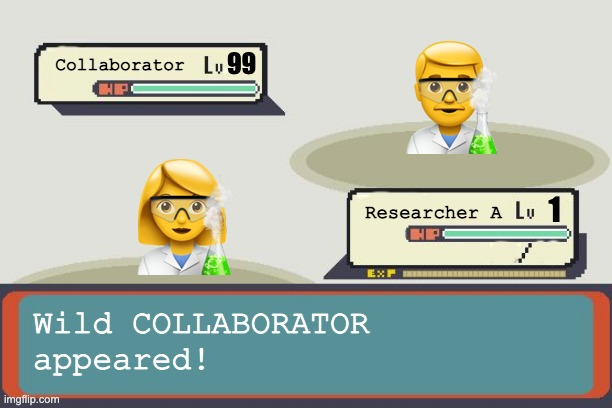
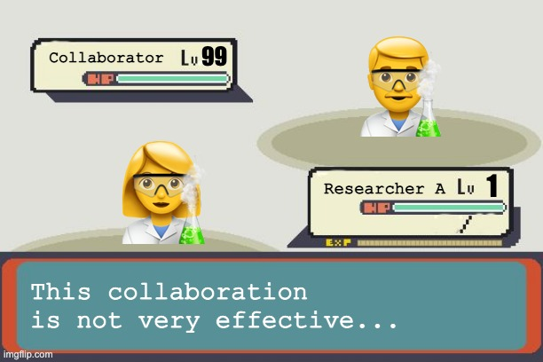

class: center

# Reproducibility
### in computational research project


#### Albert Henry
```{r setup, include=FALSE}
options(htmltools.dir.version = FALSE)
```

```{r xaringan-themer, include = FALSE}
library(xaringanthemer)

mono_accent(
  base_color = "#01223F",
  header_font_google = google_font("Raleway"),
  text_font_google   = google_font("Lato", "400", "400i"),
  code_font_google   = google_font("Droid Mono"),
  text_font_size = "24px",
  header_font_weight = "bolder",
  code_font_size = "0.5em",
  table_row_even_background_color = "#F0F0F0",
)

extra_css <- list(
  ".shadow" = list("text-shadow" = "0 0 10px #000"),
  ".blue2" = list(color = "#36BDF2"),
  ".blue3" = list(color = "#00F2F5"),
  ".gray" = list(color = "lightgray"),
  ".red"   = list(color = "firebrick", opaciy = "1"),
  ".blue" = list(color = "steelblue", opaciy = "1"),
  ".orange" = list(color = "orange", opaciy = "1"),
  ".green" = list(color = "seagreen", opacity = "1"),
  ".violet" = list(color = "darkorchid", opaciy = "1"),
  ".large125" = list("font-size" = "125%"),
  ".large150" = list("font-size" = "150%"),
  ".large200" = list("font-size" = "200%"),
  ".large300" = list("font-size" = "300%"),
  ".small75" = list("font-size" = "75%"),
  ".small50" = list("font-size" = "50%"),
  ".translucent" = list("opacity" = "0.4"),
  ".full-width" = list(
    display = "flex",
    width   = "100%",
    flex    = "1 1 auto"
  ),
  ".remark-slide-number" = list("opacity" = "0")
)

style_extra_css(extra_css)
```

---
# Motivation

.center[]


---
# Motivation

.pull-left[

]

.pull-right[

]

.small75[https://www.nature.com/news/1-500-scientists-lift-the-lid-on-reproducibility-1.19970]
---
## What is reproducibility?


.small75[The Turing Way Community, Becky Arnold, Louise Bowler, Sarah Gibson, Patricia Herterich, Rosie Higman, … Kirstie Whitaker. (2019, March 25). The Turing Way: A Handbook for Reproducible Data Science (Version v0.0.4). Zenodo. http://doi.org/10.5281/zenodo.3233986]

---
### Why reproducible research is difficult?
.large125[
* Different project scale

* Different project goals

* Takes time and effort

* Different standards

* Resource (un)availability

* Lack of training and incentives
]

---
### Why reproducible research is difficult?

#### _Different project scale_


---
.pull-left[
### Why reproducible research is difficult?

#### _Different project goals_
]
.pull-right[]


---
### Why reproducible research is difficult?

#### _Takes time and effort_
<br/>
.center[

.small75[https://imgs.xkcd.com/comics/the_general_problem.png]
]
---
### Why reproducible research is difficult?

#### _Different standards_

.pull-left[



]
.pull-right[



]

---
### Why reproducible research is difficult?

#### _Resource (un)availability_
.center[

]

---
### Why reproducible research is difficult?

#### _Lack of training and incentives_
.center[

]
---
## 

Agile software development practices

> _In software development, agile (sometimes written Agile) practices approach discovering requirements and developing solutions through the collaborative effort of self-organizing and cross-functional teams and their customer(s)/end user(s). It advocates adaptive planning, evolutionary development, early delivery, and continual improvement, and it encourages flexible responses to change_

.small75[https://en.wikipedia.org/wiki/Agile_software_development]

---
## How can we fix this?

_The Turing Way_: an open source community-driven guide to reproducible, ethical, inclusive and collaborative data science
.center[


.small75[https://the-turing-way.netlify.app/]
]

---
## Project design

_[https://github.com/alhenry/project-template](https://github.com/alhenry/project-template)_

A moderately opinionated file structure template for computational research project aiming to produce a written report

#### Core principles:

* ___Consistent___ – follow certain structure and format

* ___Simple___ – easy to follow and clear enough for someone unfamiliar with the project

* ___Scalable___ – can be used for small or big projects of many kinds

* ___Portable___ – easy to import, export, and sync to various computing platforms

---
_[https://github.com/alhenry/project-template](https://github.com/alhenry/project-template)_

### Pre-requisites
1. [python 3](https://docs.python.org/3/using/index.html)

1. [cookiecutter](https://cookiecutter.readthedocs.io/en/1.7.0/installation.html)

1. [git](https://git-scm.com/book/en/v2/Getting-Started-Installing-Git)

1. GitHub account

1. [Google account](https://support.google.com/accounts/answer/27441?hl=en)

1. [Google Backup & Sync](https://www.google.com/drive/download/backup-and-sync/) (Windows / Mac only)

1. [ssh](https://www.ssh.com/ssh)

1. [Optional] [sshfs](https://www.digitalocean.com/community/tutorials/how-to-use-sshfs-to-mount-remote-file-systems-over-ssh)

1. [Optional] [rclone](https://rclone.org/)

---
### Directory structure

```r
./
├── .git/ # hidden folder for git version control
|
├── admin/ # admin documents, e.g. meeting notes, applications, ethical approvals, MTA
|   └── meeting_notes.gsheet
|
├── data/ # read only data files used as input for analysis and results
|   ├── 2020-01/
|   |   ├── iris.tsv
|   |   └── mtcars.csv
|   └── 2020-02/
|   
├── scripts/ # analysis scripts
|   ├── 2020-01/
|   |   ├── s01_data_generation.sh
|   |   ├── s02.1_calculate_desc_stats_table1.R
|   |   └── s02.2_figure1.ipynb
|   └── 2020-02/
|
├── exploratory/ # scratch space for temporary output files / exploratory data analysis
|
├── results/ # output of data analysis e.g. tables, figures, jupyter notebook
|   ├── 2020-01/
|   |   ├── table1.tsv
|   |   └── figure1.png
|   └── 2020-02/
|
├── writing/ # Documents for writing
|   ├── main_text.gdoc
|   ├── supplementary_table.gsheet
|   └── analysis_plan.gdoc
|
└── ...
```

---
### Computing platforms

* **local** - local machine e.g. personal laptop, UCL machine

* **remote** - remote computing platform, typically a headless machine in HPC cluster (e.g. [UCL Myriad](https://wiki.rc.ucl.ac.uk/wiki/Myriad), UCL CS Cluster) or cloud computing services (e.g. [Amazon Web Service](https://aws.amazon.com/), [Google Computing Platform](https://cloud.google.com/)

* **GDrive** - Google Drive

* **GitHub** - GitHub

* **storage** - data storage space (for backup only) e.g. [UCL Research Data Storage Service](https://www.ucl.ac.uk/isd/services/research-it/research-data-storage-service), [UCL S: drive](https://www.ucl.ac.uk/isd/support-staff/s-drive-documentation/s-drive-how-it-works-permissions)

---
### Which folders live in which platforms?
|             | local | remote | GDrive | GitHub | storage |
|-------------|:-----:|:------:|:------:|:------:|:-------:|
| **.git**        |   ✅   |    ✅   |        |    ✅   |         |
| **admin**       |   ✅   |        |    ✅   |        |         |
| **data**        |       |    ✅   |        |        |    ✅    |
| **scripts**     |   ✅   |    ✅   |        |    ✅   |         |
| **exploratory** |   ✅   |    ✅   |        |        |         |
| **results**     |       |    ✅   |    ✅   |        |         |
| **writing**     |   ✅   |        |    ✅   |        |         |

---
### How to transfer / sync files across platforms?

|         | local         | remote        | GDrive                                | GitHub                                | storage       |
|---------|---------------|---------------|---------------------------------------|---------------------------------------|---------------|
| **local**   |               | ssh           | rclone<br>GBS                         | git                                   | ssh<br>rclone |
| **remote**  | ssh<br>rclone |               | rclone                                | git                                   | ssh<br>rclone |
| **GDrive**  | rclone<br>GBS | rclone        |                                       | rclone (via local)<br>GBS (via local) | rclone        |
| **GitHub**  | git           | git           | rclone (via local)<br>GBS (via local) |                                       | git           |
| **storage** | ssh<br>rclone | ssh<br>rclone | rclone                                | git                                   |               |

.small75[
* **ssh** - [Secure Shell protocol](https://www.ssh.com/ssh), also see [**sshfs**](https://www.digitalocean.com/community/tutorials/how-to-use-sshfs-to-mount-remote-file-systems-over-ssh) for mounting remote file system to local machine via ssh protocol
* **GBS** - [Google Backup & Sync](https://www.google.com/drive/download/backup-and-sync/)
* [**git**](https://git-scm.com/book/en/v2/Getting-Started-Installing-Git)
* [**rclone**](https://rclone.org/)

]

---
### Further reference

.small75[
**Reproducible research**
- [CodeRefinery](https://coderefinery.github.io/reproducible-research/)
- [The Turing Way](https://the-turing-way.netlify.com/)

**File organization**
- [A Quick Guide to Organizing Computational Biology Projects](https://journals.plos.org/ploscompbiol/article?id=10.1371/journal.pcbi.1000424)
- [MIT Comm Kit - File Structure](https://mitcommlab.mit.edu/broad/commkit/file-structure/)

**Coding style**
- General recommendations: [MIT Comm Kit - Coding and Comment Style](https://mitcommlab.mit.edu/broad/commkit/coding-and-comment-style/)
- Python: [Google Python Style Guide](https://google.github.io/styleguide/pyguide.html)
- R: [tydyverse style guide](https://style.tidyverse.org/)


**Other templates**
- [Cookiecutter Data Science](https://drivendata.github.io/cookiecutter-data-science/)
- [R ProjectTemplate](http://projecttemplate.net/index.html)
]

---
## Closing remarks

--
* Reproducible research is difficult, but **not impossible**

--
* Due to the nature of modern research  culture (or work culture in general), it is unlikely to have a one-size-fits-all solution

--
* Consider: **scale, goals, contributors, time, access to resources**

--
* Practicing reproducible reseach should not sacrifice quality of outputs and more importantly, the **joy of research ✨**

.center[

]
