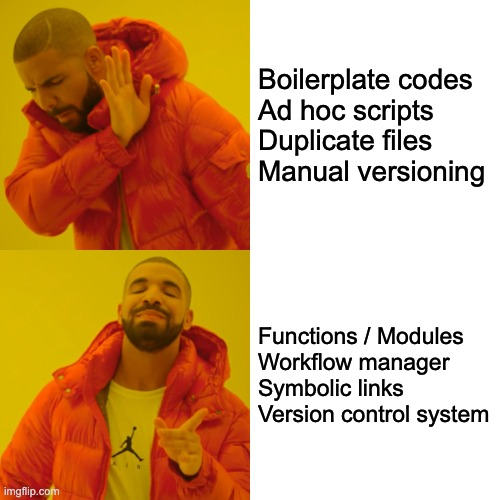

class: center

## **Reproducibility** in computational research project


#### Albert Henry

.small75[
[https://alhenry.github.io/reproducibility-presentation](https://alhenry.github.io/reproducibility-presentation)
]

```{r setup, include=FALSE}
options(htmltools.dir.version = FALSE)
```

```{r xaringan-themer, include = FALSE}
library(xaringanthemer)

mono_accent(
  base_color = "#01223F",
  header_font_google = google_font("Raleway"),
  text_font_google   = google_font("Lato", "400", "400i"),
  code_font_google   = google_font("Droid Mono"),
  text_font_size = "24px",
  header_font_weight = "bolder",
  code_font_size = "0.5em",
  table_row_even_background_color = "#F0F0F0",
)

extra_css <- list(
  ".shadow" = list("text-shadow" = "0 0 10px #000"),
  ".blue2" = list(color = "#36BDF2"),
  ".blue3" = list(color = "#00F2F5"),
  ".gray" = list(color = "lightgray"),
  ".red"   = list(color = "firebrick", opaciy = "1"),
  ".blue" = list(color = "steelblue", opaciy = "1"),
  ".orange" = list(color = "orange", opaciy = "1"),
  ".green" = list(color = "seagreen", opacity = "1"),
  ".violet" = list(color = "darkorchid", opaciy = "1"),
  ".large125" = list("font-size" = "125%"),
  ".large150" = list("font-size" = "150%"),
  ".large200" = list("font-size" = "200%"),
  ".large300" = list("font-size" = "300%"),
  ".small75" = list("font-size" = "75%"),
  ".small50" = list("font-size" = "50%"),
  ".translucent" = list("opacity" = "0.4"),
  ".full-width" = list(
    display = "flex",
    width   = "100%",
    flex    = "1 1 auto"
  ),
  ".remark-slide-number" = list("opacity" = "0")
)

style_extra_css(extra_css)
```


---
# Motivation

.pull-left[

]

.pull-right[

]

.small75[https://www.nature.com/news/1-500-scientists-lift-the-lid-on-reproducibility-1.19970]
---
## What is reproducibility?

.center[


.small75[
The Turing Way project illustration by Scriberia. DOI: 10.5281/zenodo.3332807.
]
]
---
### Tips for reproducibility
.large125[
* Define & design the project

* Minimise duplication

* Minimise non-reproducible actions

* Document everything!
]

---
### Tips for reproducibility

.pull-left[

**Define & design the project**

* What are the aims & objectives?

* Who is / are responsible?

* What resources are needed?

* What are the expected outputs?

* Who needs to have access?

<br/>
**Top Tip**:

More people 👉 more rigour
]

.pull-right[

.small75[https://imgs.xkcd.com/comics/the_general_problem.png]
]

---
### Tips for reproducibility
.pull-left[
**Minimise duplication**


**Top tip**

Larger effort 👉 Less duplication
]

.pull-right[


]

---
### Tips for reproducibility

.pull-left[
**Minimise non-reproducible actions**

* Make plans for adding / editing data

* Track changes

* Devise a strategy for branching & merging

* ⚠️ ***Document everything!***

<br/>
**Top tip**

Write ***time-stamped notes*** for major / breaking changes

]

.pull-right[
.center[

.small50[https://digitalvarys.com/git-branch-and-its-operations/]
]

]

---
## Project design

_[https://github.com/ihi-comp-med/project-template](https://github.com/ihi-comp-med/project-template)_

A moderately opinionated file structure template for computational research project

#### Core principles:

* ___Consistent___

* ___Simple___

* ___Scalable___

* ___Portable___

---
_[https://github.com/alhenry/project-template](https://github.com/alhenry/project-template)_

### Pre-requisites
1. [python 3](https://docs.python.org/3/using/index.html)

1. [cookiecutter](https://cookiecutter.readthedocs.io/en/1.7.0/installation.html)

1. [git](https://git-scm.com/book/en/v2/Getting-Started-Installing-Git)

1. GitHub account

1. [Google account](https://support.google.com/accounts/answer/27441?hl=en)

1. [Google Backup & Sync](https://www.google.com/drive/download/backup-and-sync/) (Windows / Mac only)

1. [ssh](https://www.ssh.com/ssh)

1. [Optional] [sshfs](https://www.digitalocean.com/community/tutorials/how-to-use-sshfs-to-mount-remote-file-systems-over-ssh)

1. [Optional] [rclone](https://rclone.org/)

---
## Directory structure

[Refer to documentation in Notion for latest version](https://www.notion.so/comp-med-lab/Project-Template-a0ac2a2b4a6942ef8c66f5780679511b)

---
### Computing platforms

* **local** - local machine e.g. personal laptop, UCL machine

* **compute** - remote computing platform, typically a headless machine in HPC cluster (e.g. [UCL Myriad](https://wiki.rc.ucl.ac.uk/wiki/Myriad), UCL CS Cluster) or cloud computing services (e.g. [Amazon Web Service](https://aws.amazon.com/), [Google Computing Platform](https://cloud.google.com/)

* **drive** - remote disk drive, typically for sharing results / collaborative writing, e.g. Google Drive / OneDrive

* **code** - remote code repository e.g. GitHub / GitLab

* **archive** - remote storage for data backup / project archive e.g. [UCL Research Data Storage Service](https://www.ucl.ac.uk/isd/services/research-it/research-data-storage-service), [UCL S: drive](https://www.ucl.ac.uk/isd/support-staff/s-drive-documentation/s-drive-how-it-works-permissions)

---
### Which folders live in which platforms?
|                 | local | compute | drive | code | archive |
|-----------------|:-----:|:------:|:------:|:------:|:-------:|
| **.git**        |   ✅  |    ✅   |        |    ✅   |         |
| **resources**   |       |    ✅   |        |        |    ✅    |
| **scripts**     |   ✅  |    ✅   |        |    ✅   |         |
| **results**     |       |    ✅   |    ✅   |        |         |
| **workflow**    |   ✅  |   ✅    |      |    ✅   | |      

---
### How to transfer / sync files across platforms?

|         | local         | compute        | drive                                | code                                | archive       |
|---------|---------------|---------------|---------------------------------------|---------------------------------------|---------------|
| **local**   |               | ssh           | rclone<br>GBS                         | git                                   | ssh<br>rclone |
| **remote**  | ssh<br>rclone |               | rclone                                | git                                   | ssh<br>rclone |
| **compute**  | rclone<br>GBS | rclone        |                                       | rclone (via local)<br>GBS (via local) | rclone        |
| **drive**  | git           | git           | rclone (via local)<br>GBS (via local) |                                       | git           |
| **archive** | ssh<br>rclone | ssh<br>rclone | rclone                                | git                                   |               |

.small75[
* **ssh** - [Secure Shell protocol](https://www.ssh.com/ssh), also see [**sshfs**](https://www.digitalocean.com/community/tutorials/how-to-use-sshfs-to-mount-remote-file-systems-over-ssh) for mounting remote file system to local machine via ssh protocol
* **GBS** - [Google Backup & Sync](https://www.google.com/drive/download/backup-and-sync/)
* [**git**](https://git-scm.com/book/en/v2/Getting-Started-Installing-Git)
* [**rclone**](https://rclone.org/)

]

---
### Further reference

.small75[
**Reproducible research**
- [CodeRefinery](https://coderefinery.github.io/reproducible-research/)
- [The Turing Way](https://the-turing-way.netlify.com/)

**File organization**
- [A Quick Guide to Organizing Computational Biology Projects](https://journals.plos.org/ploscompbiol/article?id=10.1371/journal.pcbi.1000424)
- [MIT Comm Kit - File Structure](https://mitcommlab.mit.edu/broad/commkit/file-structure/)

**Coding style**
- General recommendations: [MIT Comm Kit - Coding and Comment Style](https://mitcommlab.mit.edu/broad/commkit/coding-and-comment-style/)
- Python: [PEP 8 – Style Guide for Python Code](https://peps.python.org/pep-0008/)
- R: [tydyverse style guide](https://style.tidyverse.org/)

**Other templates**
- [Cookiecutter Data Science](https://drivendata.github.io/cookiecutter-data-science/)
- [R ProjectTemplate](http://projecttemplate.net/index.html)
]

---
## Closing remarks

--
* Reproducible research is difficult, but **not impossible**

--
* Learn from agile software development practice (from Wikipedia):
> _In software development, agile (sometimes written Agile) practices approach discovering requirements and developing solutions through the collaborative effort of self-organizing and cross-functional teams and their customer(s)/end user(s).
It advocates adaptive planning, evolutionary development, early delivery, and continual improvement, and it encourages flexible responses to change_

--
* _A foolish consistency is the hobgoblin of little minds_
– Ralph Waldo Emerson